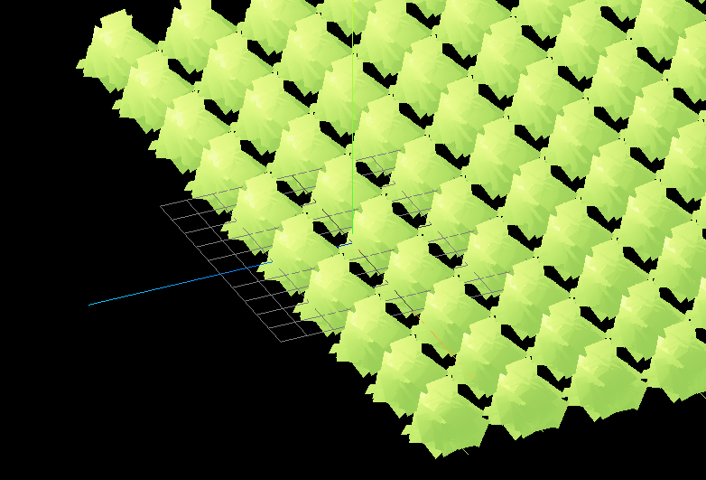

# Infinite Grass Experiment

Experiment in generating infinite grass using a minimalist TSL (Three.js Shading Language) template.

---

## Useful TSL Three.js Shading Language links

- [Official announcement and introduction](https://github.com/mrdoob/three.js/wiki/Three.js-Shading-Language)
- [Q&A](https://github.com/boytchev/tsl-textures/wiki/Q&A)
- [Three.js WebGPU examples](https://threejs.org/examples/?q=webgpu#webgpu_parallax_uv)
- [List of nodes](https://github.com/mrdoob/three.js/blob/423f285d5d868dd128d6f143dc8ec31154018f57/src/nodes/Nodes.js#L42)
- [TSL => WGSL / GLSL](https://threejs.org/examples/?q=webgpu#webgpu_tsl_editor)
- [GLSL => TSL](https://threejs.org/examples/?q=webgpu#webgpu_tsl_transpiler)
- [TSL textures](https://github.com/boytchev/tsl-textures) ([demos](https://boytchev.github.io/tsl-textures/))
- [Three.js WebGPURenderer](https://medium.com/@christianhelgeson/three-js-webgpurenderer-part-1-fragment-vertex-shaders-1070063447f0)

---

## Grass Learning References

- [Grass with Shader displacement map for wind](https://jsfiddle.net/felixmariotto/hvrg721n/)
- [Proctree.js - Procedural tree creation library - last updated 9 years ago](https://github.com/supereggbert/proctree.js/?tab=readme-ov-file)

## Setup
Download [Node.js](https://nodejs.org/en/download/).
Run this followed commands:

``` bash
# Install dependencies (only the first time)
npm install

# Run the local server at localhost:8080
npm run dev

# Build for production in the dist/ directory
npm run build
```

# Iterations




---

## Learnings

- Shader uniforms are set to null and set later if we're trying to use multiple instances of the same material. Otherwise, shader material won't be visible due to fixed coordinates. [See this issue & possible Troika JS solution](https://discourse.threejs.org/t/apply-shader-to-a-instanced-mesh/53169)
- Besides that, in Three.js, when using THREE.InstancedMesh, all instances share the same material and, consequently, the same set of uniforms. This means you cannot directly set different uniform values for each instance. So using a mesh instead of an instanced mesh would also work.


## Coding Diary

20 Jan 2025 - Issues to solve:
1. Despite having an orthographic camera, where objects are means to have the same size on screen, bushes look like they have different sizes.
2. The scene is cut off in a circular shape. Bushes outside of that circular shape are not visible.
3. Offsetting the grass meshes to the center of the grid is not working.
4. When camera gets close to the bushes, some bushes will disappear.

-> Camera/lights are not the issue. Issue is the Shader Material.
  1. Either I'm not changing / setting the uniforms correctly.
    - Which uniforms are affecting scale?
    - Which uniforms are affecting the distance of the grass?
    - Which uniforms are pointless?
  2. Can switch into TSL.

Are there any uniforms affecting scale? Yes.
  - Need to ensure that no uniforms are being used to scale the objects based on their distance from the origin or camera.
  - **Or alternatively, I can code the grass blades, camera position and then think about player position shaders.**
  - Or even start with creating a terrain with elevation.

20 Jan 2025 - Adding a matcap material:
1. Changed the vite configuration to serve the correct public folder. It wasn't allowing any local images to be loaded. Check network tab > image preview. If it doesn't show up, something is wrong with the path.
2. As such, the path should always be the name of the file directly down from the public folder instead of the typical relative path - "../public/greenmatcap.png" - at least with Vite.

--

End Goal:
- Visuals: Studio Ghibli Grass
- Interaction: Mouse move triggers position change OR wind - as if we're running a hand through grass - similar to lake or pond scene.

--

Note: local parent folder name changed from 0 Three JS Journey to 0_Three_JS_Journey. Could affect git repository settings.
